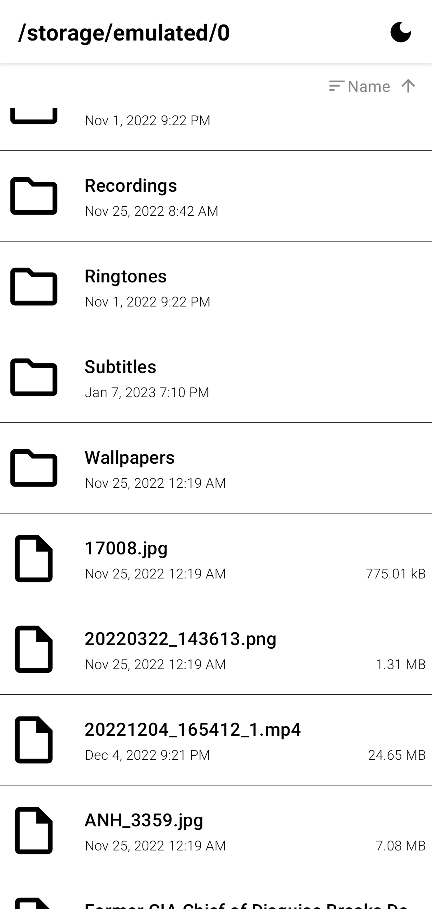
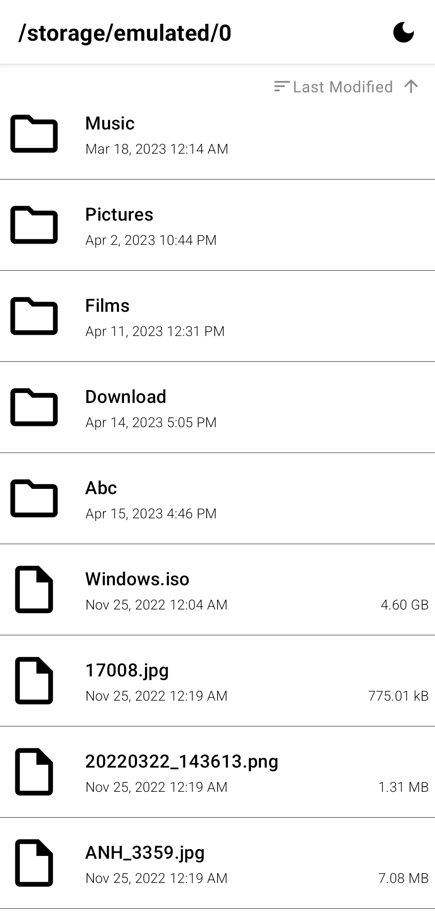
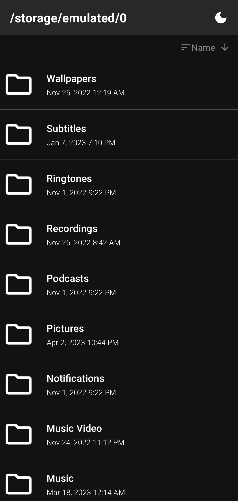
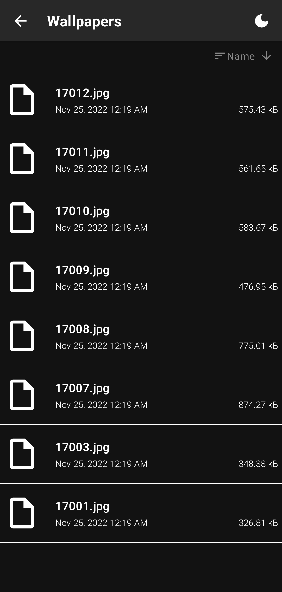
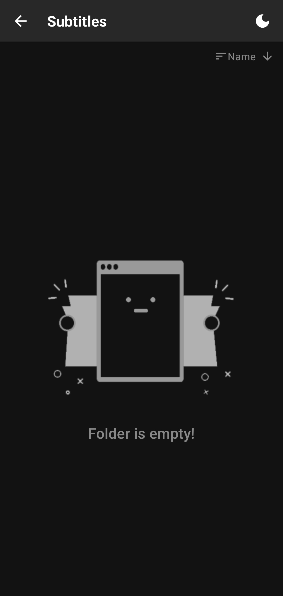

## Features of the app

- Show all volumes, all files and folders inside each
- Sort by name, last modified time and size
- Light/Dark theme

## Compiled apk file (for convenience) at: /app/release/

## Features to add:

- Copy, move, delete, rename files and folders

## Screenshots:

    
    
    
    
    

